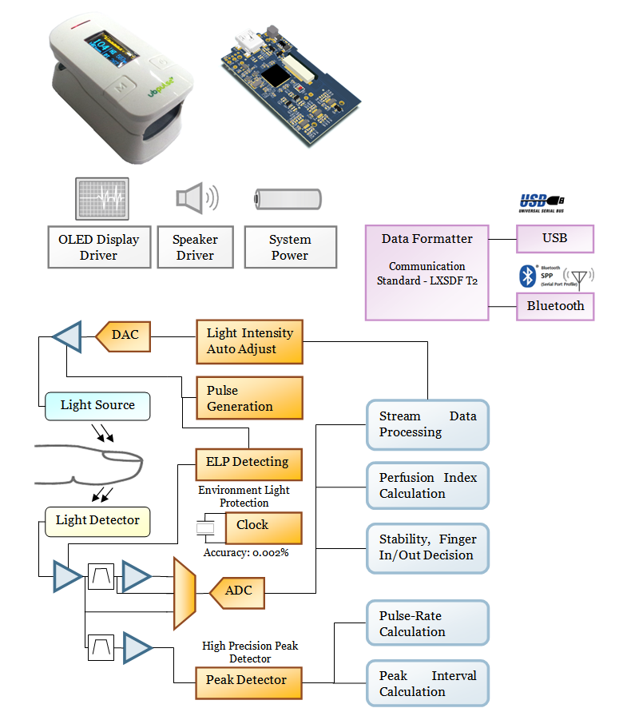

# ubpulse-360-340-320

### Features 
- Optical Sensor for Measuring Heart Rate
- Analog front end, Microcontroller, Battery Power Circuit
- Standalone OLED Display
- Bluetooth. ( ubpulse 360 )
- USB. ( ubpulse 360, ubpulse 340 )
- UART. ( ubpulse 320 ) easily connected with embedded system. 
- Speaker
- Digital Signal Processing
- Real Time Communications

### For App. Developer 
- ubpulse 3 series‘s communication formats are fully opened.
- You can make your own applications  
- medical quality heart rate
- and all of data from the ubpulse 3 series.

### Function Block

